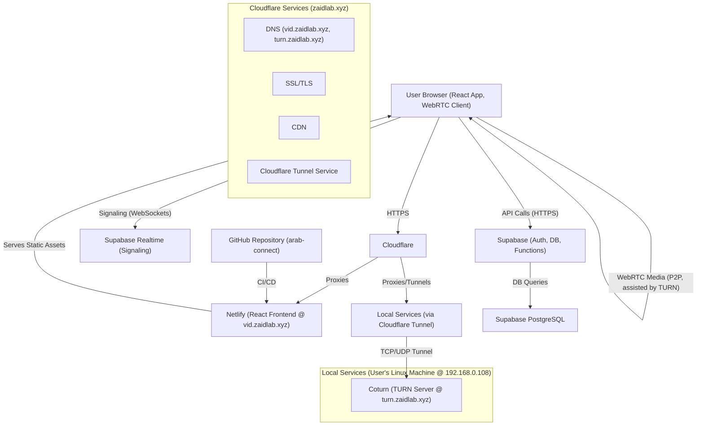

# Project Plan: ArabConnect (vid.zaidlab.xyz)

**Last Updated:** 2025-05-11

**Core Goal:** Create a web app like Chatroulette/Omegle, tailored for the Arab world, using free tools, Material You design, mobile/desktop friendly, deployable via Netlify from GitHub, using Supabase for DB, and Cloudflare.

## I. Architecture Overview



## II. Technology Stack

*   **Frontend Framework:** React with Vite
*   **UI Library:** Material UI (MUI) v5+ (Material You theming)
*   **Styling:** MUI's built-in styling (Emotion/Styled Components)
*   **State Management:** Zustand or React Context API
*   **Routing:** React Router
*   **Internationalization (i18n):** `i18next` with `react-i18next`
*   **WebRTC Client-Side:** Native browser APIs
*   **Signaling Server:** Supabase Realtime
*   **STUN Servers:** Public free STUN servers (e.g., `stun:stun.l.google.com:19302`)
*   **TURN Server:** Coturn on local Linux machine (192.168.0.108) exposed via Cloudflare Tunnel at `turn.zaidlab.xyz` (realm: `turn.zaidlab.xyz`)
*   **Database & Auth:** Supabase (PostgreSQL, Supabase Auth)
*   **Storage:** Supabase Storage (for future use)
*   **Code Repository:** GitHub
*   **CI/CD & Hosting:** Netlify (for `vid.zaidlab.xyz`)
*   **CDN, Proxy, SSL, Security:** Cloudflare (for `zaidlab.xyz` and its subdomains)
*   **Local Hosting OS:** Ubuntu Server (on 192.168.0.108)

## III. Project Directory Structure (React App: `arab-connect`)

```
arab-connect/
├── public/
├── src/
│   ├── assets/
│   ├── components/
│   │   ├── common/
│   │   ├── layout/
│   │   ├── LandingPage/
│   │   └── ChatView/
│   ├── contexts/
│   ├── hooks/ (e.g., useWebRTC, useSignaling)
│   ├── services/
│   │   ├── supabaseClient.js
│   │   └── signalingService.js
│   ├── theme/
│   │   └── materialYouTheme.js
│   ├── locales/ (en, ar)
│   ├── App.jsx
│   ├── main.jsx
│   ├── i18n.js
│   └── index.css
├── .env
├── vite.config.js
├── package.json
└── README.md
```

## IV. Development Phases & Tasks

### Phase 0: Setup & Local Hosting
*   [X] **Project Setup:**
    *   [X] Create GitHub repository (e.g., `arab-connect`).
    *   [X] Create Supabase project.
    *   [X] Setup Netlify site linked to GitHub for `vid.zaidlab.xyz`.
    *   [X] Configure Cloudflare DNS for `vid.zaidlab.xyz` (CNAME to Netlify) and `turn.zaidlab.xyz` (for Cloudflare Tunnel).
*   [X] **Local Environment Setup (Linux Machine - 192.168.0.108):**
    *   [ ] Install Node.js (if needed for any local tooling).
    *   [X] Install Coturn: `sudo apt-get install coturn`.
    *   [X] Configure Coturn (`/etc/turnserver.conf`):
        *   Set `listening-ip=192.168.0.108` (or `0.0.0.0`).
        *   Set `realm=turn.zaidlab.xyz`.
        *   Configure `lt-cred-mech` or `static-auth-secret`.
        *   Ensure `listening-port=3478` (or chosen port).
    *   [X] Start and enable Coturn service.
*   [X] **Cloudflare Tunnel Setup (Linux Machine):**
    *   [X] Install `cloudflared`.
    *   [X] Login: `cloudflared tunnel login`.
    *   [X] Create tunnel: `cloudflared tunnel create turn-tunnel`.
    *   [X] Configure DNS for tunnel: `cloudflared tunnel route dns turn-tunnel turn.zaidlab.xyz`.
    *   [X] Create `config.yml` for `cloudflared` to map `turn.zaidlab.xyz` (TCP/UDP on port 3478) to `localhost:3478` (or `192.168.0.108:3478`).
    *   [X] Run/Enable `cloudflared` service with the tunnel configuration.
*   [X] **Initial React App Setup (`arab-connect` directory):**
    *   [X] Initialize Vite + React project.
    *   [X] Install core dependencies (`react-router-dom`, `@mui/material`, `@emotion/react`, `@emotion/styled`, `i18next`, `react-i18next`, `@supabase/supabase-js`, `zustand`).
    *   [X] Basic project structure (folders as per section III).

### Phase 1: Core WebRTC & Signaling (Proof of Concept)
*   [X] **Local Video Display:**
    *   [X] Implement `getUserMedia` to access camera/microphone and display local video stream.
*   [X] **WebRTC Connection Logic (`useWebRTC.js` hook):**
    *   [X] `RTCPeerConnection` setup.
    *   [X] STUN/TURN server configuration (using `turn.zaidlab.xyz`).
        ```javascript
        // Example iceServers config
        const iceServers = [
            { urls: 'stun:stun.l.google.com:19302' },
            { urls: 'stun:stun1.l.google.com:19302' },
            {
                urls: 'turn:turn.zaidlab.xyz:3478', // Ensure port matches Coturn & Tunnel
                username: 'your_turn_username', // Replace with actual username
                credential: 'your_turn_password', // Replace with actual password
            }
        ];
        ```
    *   [X] Creating offers/answers.
    *   [X] Handling ICE candidates.
*   [X] **Signaling Logic (`signalingService.js` using Supabase Realtime):**
    *   [X] Connect to Supabase client.
    *   [ ] Implement logic to join/leave `public:waiting_pool` channel with presence.
    *   [ ] Implement logic for creating/joining `private:chat_room_[id]_[id]` channels.
    *   [ ] Send/receive signaling messages (offer, answer, ICE, pairing notifications) via broadcast on chat room channels.
*   [ ] **Basic Matchmaking (Client-side or Supabase Function):**
    *   [ ] Simple logic to pair users from the `waiting_pool`.
*   [ ] **Achieve Two-Way Video/Audio Chat:**
    *   [ ] Test connection between two browser instances using the full STUN/TURN/Signaling setup.
    *   [ ] Debug using `chrome://webrtc-internals`.

### Phase 2: UI/UX & Material You
*   [ ] **Context7 Research (MUI & Material Design):**
    *   [ ] Use `resolve-library-id` for "Material UI" and "Material Design".
    *   [ ] Use `get-library-docs` for theming, responsive components, RTL, and best practices.
*   [ ] **MUI Integration & Theming (`theme/materialYouTheme.js`):**
    *   [ ] Setup basic Material You theming (dynamic colors if feasible, or user-selectable light/dark themes).
    *   [ ] Apply theme globally.
*   [ ] **Layout Components (`components/layout/`):**
    *   [ ] `MainLayout.jsx` (AppBar, content area, Footer).
    *   [ ] Responsive design for mobile and desktop.
*   [ ] **Page Components:**
    *   [ ] `LandingPage.jsx` (`components/LandingPage/`): Intro, "Start Chat", language selector, guidelines.
    *   [ ] `ChatView.jsx` (`components/ChatView/`): Local/Remote video displays, controls.
*   [ ] **Chat Controls (`components/ChatView/Controls.jsx`):**
    *   [ ] Mute/Unmute microphone.
    *   [ ] Start/Stop video.
    *   [ ] "Next Chat" button.
    *   [ ] "Report User" button (UI only initially).
*   [ ] **RTL Support:**
    *   [ ] Configure MUI for RTL.
    *   [ ] Test Arabic language display and layout.

### Phase 3: Supabase Integration & User Flow
*   [ ] **Supabase Client Setup (`services/supabaseClient.js`).**
*   [ ] **Authentication (`contexts/AuthContext.js` or similar):**
    *   [ ] Integrate Supabase Auth (Email/Password or Anonymous).
    *   [ ] Signup/Login/Logout flows.
    *   [ ] Protect chat routes.
*   [ ] **User Profiles (`user_profiles` table):**
    *   [ ] Create table in Supabase.
    *   [ ] Logic to create profile on signup.
    *   [ ] Allow users to set basic preferences (e.g., language).
*   [ ] **Chat Flow Logic:**
    *   [ ] "Start Chat" -> "Searching for partner" (updates UI state).
    *   [ ] Connect to signaling, join waiting pool.
    *   [ ] Handle pairing notification -> transition to "Connected" state.
    *   [ ] Display remote peer's video.
*   [ ] **"Next Chat" Functionality:**
    *   [ ] Properly disconnect WebRTC peer connection.
    *   [ ] Leave current Supabase chat room channel.
    *   [ ] Re-join `waiting_pool` or show landing page.
*   [ ] **User Reporting (Backend Logic):**
    *   [ ] Create `reports` table in Supabase.
    *   [ ] "Report User" button sends data (reporter ID, reported ID, reason) to Supabase.
    *   [ ] Implement RLS for `reports` table.

### Phase 4: Moderation (Basic)
*   [ ] **Admin Review of Reports:**
    *   [ ] Simple way for admin to view reports (e.g., direct Supabase table access or a basic protected page).
*   [ ] **Ban System (Conceptual):**
    *   [ ] Create `banned_users` table in Supabase.
    *   [ ] Logic for admin to add users to this table.
    *   [ ] Check against `banned_users` on connection attempt (requires user to be authenticated).

### Phase 5: Localization & Polish
*   [ ] **Internationalization (`i18next` & `locales/`):**
    *   [ ] Integrate `i18next` with `react-i18next`.
    *   [ ] Create translation files for English (`en.json`) and Arabic (`ar.json`).
    *   [ ] Implement language switcher.
    *   [ ] Localize all UI text.
*   [ ] **UI/UX Refinements:**
    *   [ ] Add subtle animations and transitions.
    *   [ ] Improve visual feedback for user actions.
    *   [ ] Ensure consistent styling.
*   [ ] **Testing:**
    *   [ ] Thorough testing across major browsers (Chrome, Firefox, Safari).
    *   [ ] Test on different devices/screen sizes.
    *   [ ] Test WebRTC connection stability under various network conditions (if possible).
*   [ ] **Documentation:**
    *   [ ] Update `README.md` with setup and run instructions.
    *   [ ] Basic code comments for complex logic.

## V. Context7 Usage Plan

*   **Purpose:** To gather detailed documentation and best practices for UI/UX development, primarily focusing on Material UI and Material Design principles.
*   **Tools:** `resolve-library-id` and `get-library-docs` from the `github.com/upstash/context7-mcp` server.
*   **Targets:**
    *   Material UI (v5+): Theming, Material You, responsive components, layout systems, RTL support.
    *   Material Design: Core principles, interaction patterns, accessibility guidelines.
*   **Timing:** Primarily during **Phase 2: UI/UX & Material You**, but can be used as needed throughout development for any supported library.

## VI. Risks & Mitigations (Summary)

*   **TURN Server Reliability (Local Host):** Dependent on home internet/PC.
    *   *Mitigation:* Accept as a tradeoff for a free/hobby project. For production, a cloud TURN service would be needed.
*   **Abuse & Moderation:** Stranger chat apps are prone to abuse. Manual moderation is intensive.
    *   *Mitigation:* Clear guidelines, prominent reporting, swift (manual) action.
*   **Free Tier Limitations:** Monitor Supabase, Netlify, Cloudflare usage.
    *   *Mitigation:* Optimize, be prepared for potential scaling or service limits.
*   **WebRTC Complexity:** Debugging NAT traversal can be hard.
    *   *Mitigation:* Incremental development, thorough testing, use `webrtc-internals`.

---
